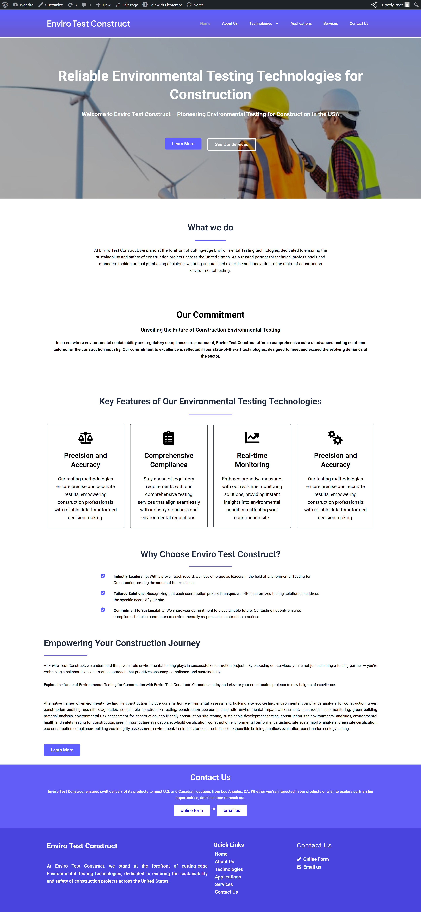
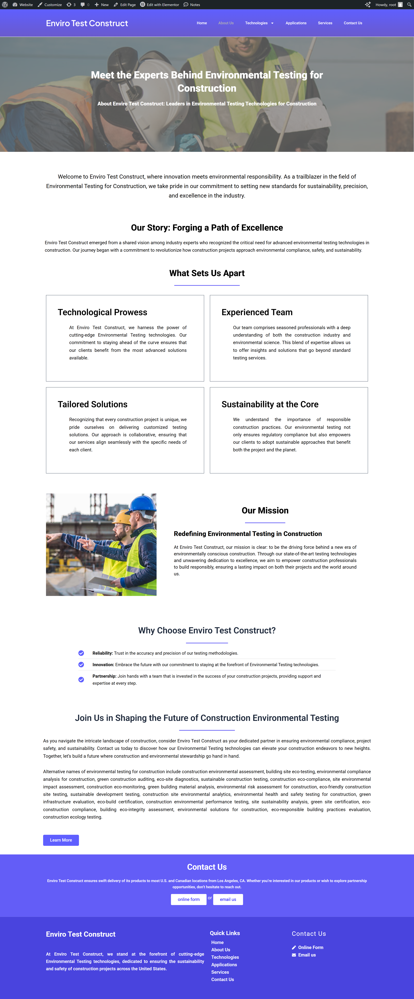
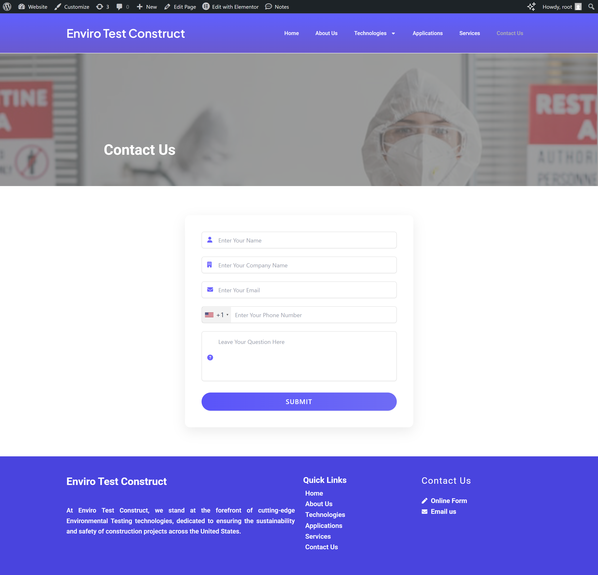

# 🌍 Enviro Test Construct Website

## 📌 Project Overview

The **Enviro Test Construct Website** is a complete multi-page web application developed during my web development internship. This project focuses on showcasing advanced environmental testing technologies used in the construction industry.

The goal of this task was to recreate a given demo website using WordPress, ensuring design consistency, proper structure, and professional UI/UX practices.

---

## 🎯 Purpose of the Project

* To understand real-world website development workflow
* To practice building a complete multi-page website
* To implement UI/UX consistency across multiple pages
* To gain hands-on experience with WordPress and Elementor
* To simulate client-based development and feedback handling

---

## 🏢 Internship Context

This project was assigned as **Website Task-1** during my internship under the **WebDev-Noah squad**.

Throughout this task:

* I developed the website from scratch based on provided demo and documentation
* Presented progress in team meetings
* Implemented feedback given by the squad leader
* Successfully completed and received final approval for the entire website

---

## 🚀 Features

* Fully responsive multi-page website
* Clean and professional UI design
* Consistent layout across all pages
* 15+ pages including:

  * Home Page
  * About Us Page
  * Technologies Page
  * Applications Page
  * Services Page
  * Contact Us Page
  * 12 Technology Sub-pages
* Custom-built contact form using HTML, CSS, and JavaScript
* Functional navigation and internal linking
* Reusable components (header, footer, sections)

---

## 🛠️ Technologies Used

* **WordPress** (CMS)
* **Elementor** (Page Builder)
* **HTML, CSS, JavaScript** (Custom Contact Form)
* **XAMPP** (Local Development Environment)
* **WPvivid Plugin** (Backup & Restore)

---

## 🧠 Development Approach

* Created full website structure (pages + navigation)
* Designed homepage and core pages first
* Maintained consistent design system (colors, spacing, typography)
* Built reusable layouts for sub-pages
* Duplicated and optimized pages for efficiency
* Tested responsiveness and UI alignment
* Implemented feedback from team reviews

---

## 📸 Screenshots

### 🏠 Home Page

### ℹ️ About Page

### 🧪 Technologies Page

### 📊 Applications Page

### 🛠️ Services Page

### 📞 Contact Us Page

### 📄 Sub Page Example

---

## 📂 Project Files

* Full website backup included (.zip file)
* Backup created using **WPvivid plugin**
* Can be restored easily on any WordPress setup

---

## 🔄 How to Run This Project

1. Install WordPress on local server or hosting
2. Install **WPvivid Backup Plugin**
3. Upload the provided backup (.zip file)
4. Restore the backup
5. Website will be fully functional

---

## 🏁 Project Status

✅ Completed
✅ Reviewed by team
✅ Approved by Squad Leader

---

## 👨‍💻 Author

**Mohammed Abdul Rahman**
Web Development Intern
WebDev-Noah Squad

---
